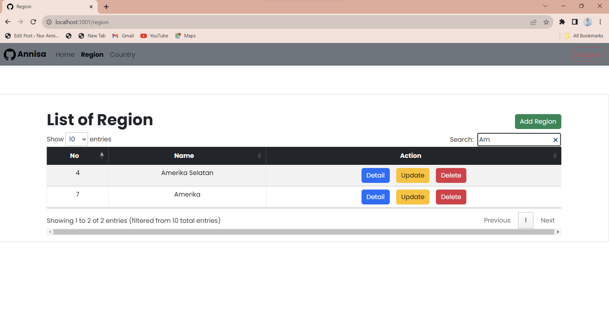

<H1>Dokumentasi CRUD Region menggunakan Ajax </H1>

<H3>Halaman Login</H3>

<H3>Input username/password</H3>
<H4>Ketika di hover ke username / password akan terdapat efek garis berwarna hijau</H4>

<H3>Eror</H3>
<H4>Ketika menginputkan username atau password salah maka akan muncul pesan eror </H4>

<H3>Home</H3>
<H4>Setelah memasukan username dan password kemudian klik button login, maka akan masuk ke halaman home</H4>

<H3>Confirm Logout</H3>
<H4>Ketika mengklik button Logout, maka akan muncul pesan confirm logout seperti pada digambar</H4>

<H3>Back Login</H3>
<H4>Ketika klik button logout maka akan kembali ke halaman login, seperti pada gambar </H4>

<H3>Halaman Utama region</H3>

<H3>Add Region</H3>

<H3>Berhasil Add Region</H3>

<H3>Update Region</H3>

<H3>Menampilkan Alert</H3>

<H3>Berhasil Update</H3>

<H3>Delete Region</H3>

<H3>Berhasil Delete Region</H3>

<H3>Mencari di pencarian Region "Amerika Timur", tidak ditemukan karena sudah berhasil di delete</H3>

